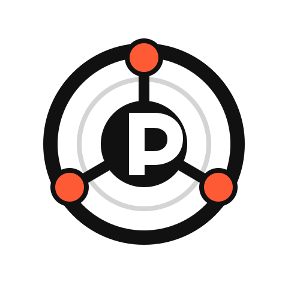
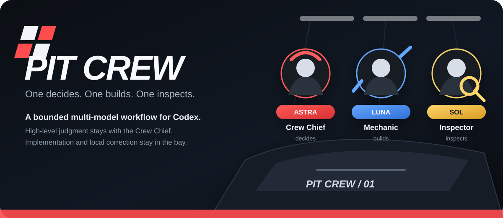
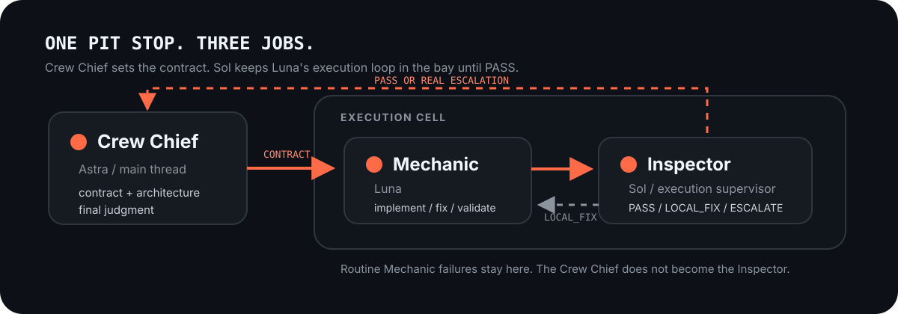

<p align="center">
  <picture>
    <source media="(prefers-color-scheme: dark)" srcset="assets/logo-dark.svg">
    
  </picture>
</p>

<h1 align="center">Pit Crew</h1>

<p align="center">
  <em>One decides. One builds. One inspects.</em>
</p>

<p align="center">
  
  
  
  
</p>

<p align="center">
  <a href="#how-it-works">How it works</a> &middot;
  <a href="#install">Install</a> &middot;
  <a href="#use">Use</a> &middot;
  <a href="#v1-is-intentionally-missing-things">V1 boundaries</a>
</p>

<p align="center">
  
</p>

<p align="center">
  <strong>The Crew Chief makes the call. The Mechanic gets under the hood. The Inspector sends it back only when something is actually wrong.</strong>
</p>

---

## Why Pit Crew?

Give one strong model a coding task and it can do everything: understand the request, choose the architecture, write the code, inspect its own diff, patch small mistakes, inspect again, and keep going until the job is clean.

**Pit Crew gives that model a crew instead.**

The main thread keeps the work that deserves high-level judgment. Luna implements a bounded packet. Sol inspects the resulting diff and only sends back corrections that have one obvious answer. Anything that changes the design goes straight back upstairs.

<p align="center">
  
</p>

## The rule

> **Do not spend Crew Chief judgment on Mechanic work. Do not let the Mechanic or Inspector redesign the car.**

Pit Crew v1 is deliberately small. It does not claim to minimize every token, and it does not add speculative routing machinery just because it might help later.

The split is simple:

| Role | Preferred model | Owns | Must not own |
|---|---|---|---|
| **Crew Chief** | Main thread, designed for Astra-class reasoning | User intent, architecture, scope, implementation contract, escalation decisions, final approval | Repetitive low-level correction loops |
| **Mechanic** | Luna when explicit routing is available | Editing, implementation, build/test, bounded fixes | Architecture redesign, scope expansion |
| **Inspector** | Sol when explicit routing is available | Diff review, contract compliance, clear local corrections | New architecture, new abstractions, ambiguous design choices |

The Crew Chief can always reject an Inspector `PASS`.

## Before / after

### One model doing the whole stop

```text
Main model
    |
    v
Design
    |
    v
Implement
    |
    v
Self-review
    |
    v
Patch
    |
    v
Self-review again
```

### Pit Crew

```text
Crew Chief
    |
    v
Mechanic (Luna)
    |
    v
Inspector (Sol)
   /            \
LOCAL_FIX     ESCALATE
   |              |
   v              v
Mechanic       Crew Chief
   |              |
   +------>-------+
          |
         PASS
          |
          v
      Crew Chief
     final review
```

The intended saving is not "make every model read less." V1 targets a clearer problem: keep the expensive main thread out of repetitive, low-level correction loops when the fix is already unambiguous.

## How it works

### 1. Crew Chief sets the contract

The main thread reads the request or mockup, inspects enough existing code to make the architecture decision, and produces a bounded implementation packet.

```text
IMPLEMENTATION PACKET
objective: <one clear objective>
scope:
- <files/systems allowed to change>
contract:
- <required behavior>
- <behavior that must be preserved>
constraints:
- <forbidden redesigns or out-of-scope work>
validation:
- <build/tests/manual checks expected>
```

### 2. Mechanic builds

Luna implements only the packet, validates what it can, and reports the concrete result.

```text
MECHANIC REPORT
changed:
- <files or symbols>
validated:
- <build/tests/checks>
uncertainty:
- <none or concrete unresolved point>
```

### 3. Inspector checks the work

Sol reviews the implementation contract, the current diff, and only the surrounding code needed to verify concrete findings.

It returns exactly one verdict class:

```text
PASS
```

or

```text
LOCAL_FIX
- location: <file/symbol>
  problem: <concrete problem>
  correction: <bounded required correction>
```

or

```text
ESCALATE
- location: <file/symbol or contract section>
  reason: <why a design/scope decision is required>
  decision_needed: <the smallest question the Crew Chief must answer>
```

### 4. Local problems stay in the bay

`LOCAL_FIX` goes back to Luna. Luna changes only that bounded issue, then Sol checks the current diff again.

A local fix is appropriate when there is one clear answer inside the existing contract, such as:

- an obvious requirement was omitted
- compile or syntax failure
- a clear local logic error
- a needless out-of-scope edit that can simply be reverted
- dead code introduced by the patch
- duplicate logic where the approved existing API already covers the job
- a local naming or consistency error with one established project convention

### 5. Design problems go upstairs

Sol must return `ESCALATE` when the resolution would require any of the following:

- moving responsibility between classes or systems
- adding, removing, or materially changing a public API
- introducing a new object, abstraction, layer, or dependency
- expanding the implementation scope
- changing the mockup, requirement, or acceptance criteria
- choosing between multiple reasonable designs
- contradicting a Crew Chief decision

### 6. Crew Chief closes the stop

Only after the Inspector returns `PASS`, the main thread performs the final architecture and intent review.

That review asks different questions from Sol:

- does the result actually satisfy the user's intent?
- does responsibility live in the right place?
- did the implementation preserve the intended architecture?
- did the local-fix loop distort or narrow the original requirement?
- is any architecture-level change unnecessary?

## Install

### Codex app (recommended)

1. Open **Plugins**.
2. Add a GitHub marketplace.
3. Use `groun519/pitcrew` as the source.
4. Use `main` as the Git ref.
5. Leave the sparse path empty.
6. Open the imported **Pit Crew** marketplace and install `pitcrew`.

### Codex CLI

```bash
codex plugin marketplace add groun519/pitcrew --ref main
codex plugin add pitcrew@pitcrew
codex plugin list
```

## Use

Ask Codex to use Pit Crew for an implementation or refactor task.

```text
Use Pit Crew for this task.
```

Or make the intended route explicit:

```text
Use Pit Crew to implement this mockup.
Keep architecture and final approval in the main thread.
Have Luna implement, Sol inspect and request only local corrections,
then perform the final review in the main thread.
```

## V1 is intentionally missing things

Pit Crew v1 does **not** include:

- mandatory Sol pre-implementation repository search
- context-pack or read-compression systems
- MCP servers
- lifecycle hooks
- automatic reasoning-effort routing
- a general-purpose multi-agent framework
- benchmark claims that have not been measured

These are candidates, not promises. They should be added only when real usage demonstrates a clear benefit.

## What we are measuring next

Before putting numbers in the hero section, Pit Crew should earn them.

The first real-world tests should track:

- Crew Chief calls per task
- Sol <-> Luna correction loops
- issues still found by the Crew Chief after Sol `PASS`
- unnecessary or incorrect Inspector corrections
- per-model usage
- total turns to a clean result

If the data later shows a reliable cost, token, or latency improvement, the README can say exactly how much. Until then, it will not pretend.

## Repository layout

```text
pitcrew/
|-- .agents/
|   `-- plugins/
|       `-- marketplace.json
|-- assets/
|   |-- logo.svg
|   |-- logo-dark.svg
|   |-- crew-banner.svg
|   |-- workflow.svg
|   `-- social-preview.svg
|-- plugins/
|   `-- pitcrew/
|       |-- .codex-plugin/
|       |   `-- plugin.json
|       `-- skills/
|           `-- pitcrew/
|               `-- SKILL.md
|-- LICENSE
`-- README.md
```

## Why the name?

A pit crew works because specialists do not all grab the same wrench.

One person makes the call. One does the work. One checks whether the car is ready to leave.

That is the whole idea.

## License

MIT
